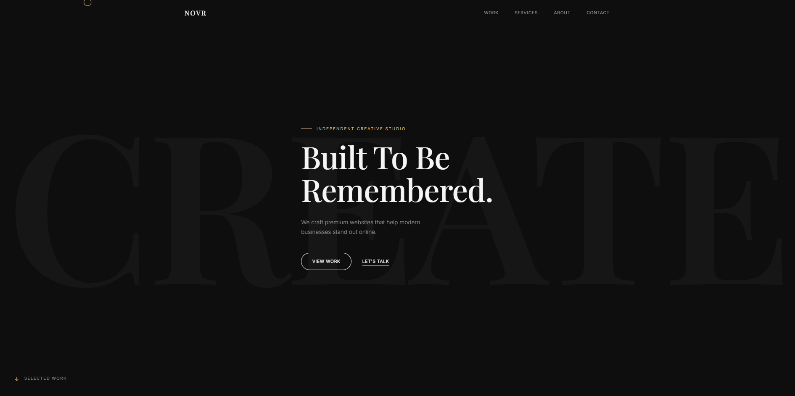

# NOVR Studio

Premium portfolio website for **NOVR Studio** — an independent creative studio focused on designing and developing modern, high-performance websites for growing brands.

Built with HTML, CSS, and vanilla JavaScript. Lightweight, responsive, and crafted with attention to typography, motion, and user experience.

---

## Preview



---

## Features

- Premium editorial-inspired design
- Responsive layout
- Smooth scrolling
- Custom cursor interaction
- Loading screen animation
- Scroll reveal animations
- Interactive project previews
- Case Study pages
- Mobile navigation
- Optimized for performance & SEO

---

## Tech Stack

- HTML5
- CSS3
- JavaScript (Vanilla)
- Google Fonts
- Vercel Deployment
- Git & GitHub

---

## Project Structure

```
novr-studio/
│
├── index.html
├── 404.html
├── work/
│   └── bean-and-brew.html
│
├── assets/
│   ├── css/
│   │   ├── style.css
│   │   └── responsive.css
│   │
│   ├── js/
│   │   └── main.js
│   │
│   └── images/
│       ├── projects/
│       ├── icons/
│       └── preview.jpg
│
└── README.md
```

---

## Lighthouse

Current goals:

- Performance **95+**
- Accessibility **95+**
- Best Practices **100**
- SEO **100**

---

## Featured Project

### Bean & Brew Coffee

A premium coffee shop landing page designed with warm tones, editorial typography, and subtle interactions.

Features include:

- Hero section
- About
- Why Choose Us
- Featured Menu
- Full Menu
- Gallery
- Testimonials
- Contact
- Responsive Design

---

## Live Demo

🌐 https://your-vercel-link.vercel.app

---

## Author

**Marcel Adrian Yoel Salim**

Founder of **NOVR Studio**

GitHub:
https://github.com/Foxxy-sys

---

## License

This project is available for portfolio purposes.

Please do not copy or redistribute the design without permission.